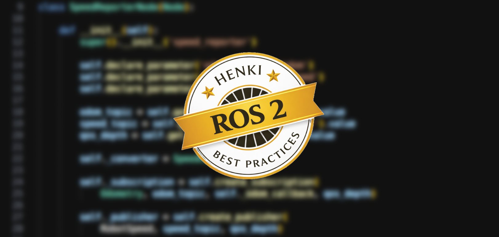
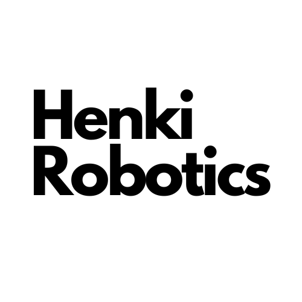

# Henki ROS 2 Best Practices

Best ROS 2 practices on architecture and clean code from [Henki Robotics](https://henkirobotics.com/). For people and AI.

## Best Practices

All the best practices are defined in a single document:
- [Henki ROS 2 Best Practices](henki_ros2_best_practices.md)

## Installation

Clone the repository in your project root folder:

```
git clone https://github.com/henki-robotics/henki_ros2_best_practices.git
```

Henki ROS 2 Best Practices can be easily integrated with your favorite coding agent:

- **Claude Code**

    Add in your `CLAUDE.md` file:
    
    ```
    Always read and follow the best practices defined in:
    - henki_ros2_best_practices/henki_ros2_best_practices.md
    ```

## Usage

**People**: Read the [best practices](henki_ros2_best_practices.md), or pass them to your coworkers. Start following them in your day-to-day development.

**AI**: If you followed the installation instructions for AI, your coding agent now automatically always complies with the best practices when writing code! Try out for example the following tasks:

> Create me a new ROS 2 package with a Python node that subscribes to /odom topic and publishes to a single topic the robot speed in km/h and mph. 

> Review my repository against the Henki ROS 2 Best Practices. Write me which parts of the system comply with the best practices, and which ones do not. Write me a review document in .md format.

## Examples

We provide a demo example of ROS 2 package generation using **Claude Code** (`claude-opus-4-6`) with and without applying our best practices.

We asked Claude to complete the following task:

```
Create me a new ROS 2 package with a Python node that subscribes to /odom topic and publishes to a single topic the robot speed in km/h and mph. 
```

In our [Agentic Examples](https://github.com/henki-robotics/henki_ros2_agentic_examples/) repository, you'll find two main folders:
- [baseline/](https://github.com/henki-robotics/henki_ros2_agentic_examples/tree/main/baseline/): Example ROS 2 package generated by AI **without** applying Henki ROS 2 best practices.
This example serves as a reference point for comparison.
- [best_practices/](https://github.com/henki-robotics/henki_ros2_agentic_examples/tree/main/best_practices): Example ROS 2 packages generated by AI **with** Henki ROS 2 best practices applied.

Compare the results and see how applying the best practices improves the generated code. Notice differences in:
- **Package structure** - Proper use of launch and config files.
- **Separation of concerns** - Separation of the core application logic from the ROS 2 node communication.
- **Message Interfaces** - Custom `RobotSpeed.msg` interface instead of deprecated `Float64MultiArray`. Separate `_msgs` package for custom messages.
- **Logging** - Throttled logs to avoid log spam.
- **Tests** - Unittests to test the core application logic. No flaky ROS communication in unittests.
- **Documentation** - Clear package README.md file with API and parameters.

> Disclaimer: We are heavily experimenting the agentic integration with the best practices. If you find any unexpected agent behavior caused by the best practices, please report in a new GitHub issue.

## Contributing

We invite all developers to contribute to the creation of high-quality best practices in this repository.
For this, we have determined few guidelines, which we obviously call **"Best practices for writing best practices"**:
- Keep the practices short, clear and concise
- Explain shortly why the practice exists.
- Do not use AI to generate new best practices.
- Ensure that all the suggested practices are based on facts and tested on real conditions. 
- Avoid suggesting subjective and personal opinions and preferences.

## Maintainers
These best practices are maintained by [Henki Robotics](https://henkirobotics.com/).


[](https://henkirobotics.com/)
